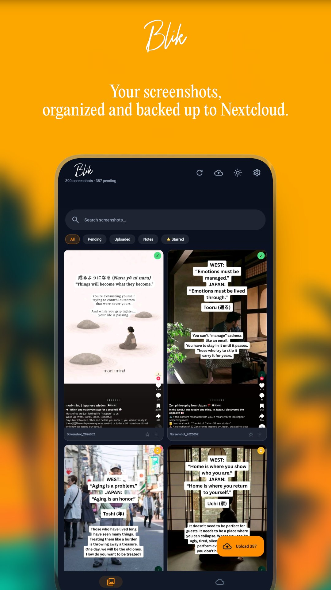
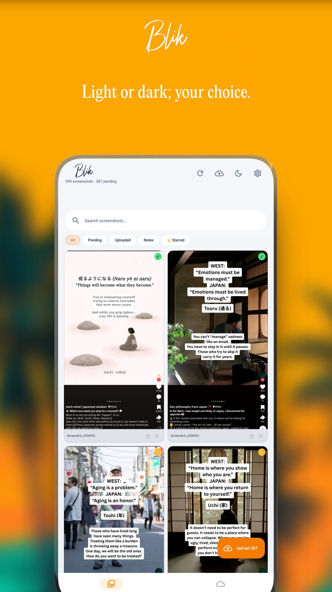
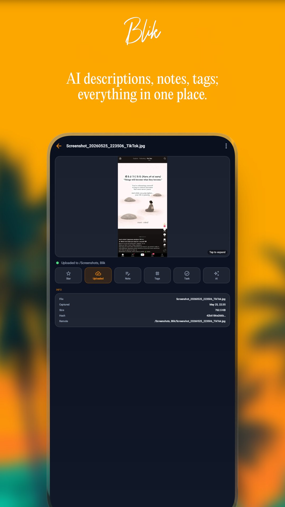
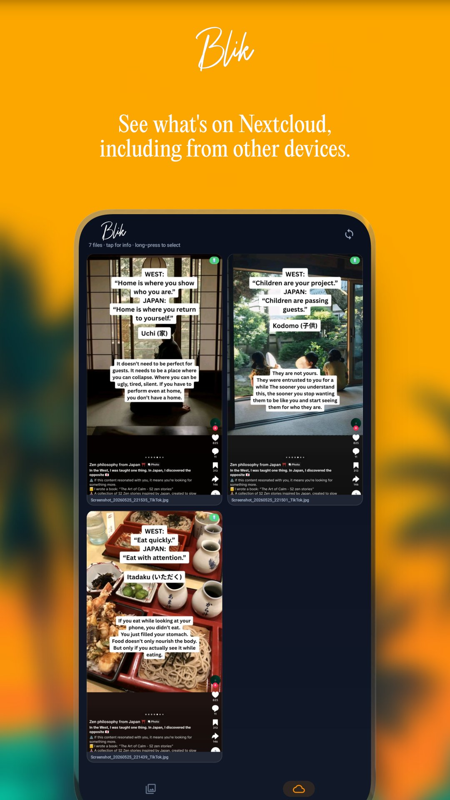
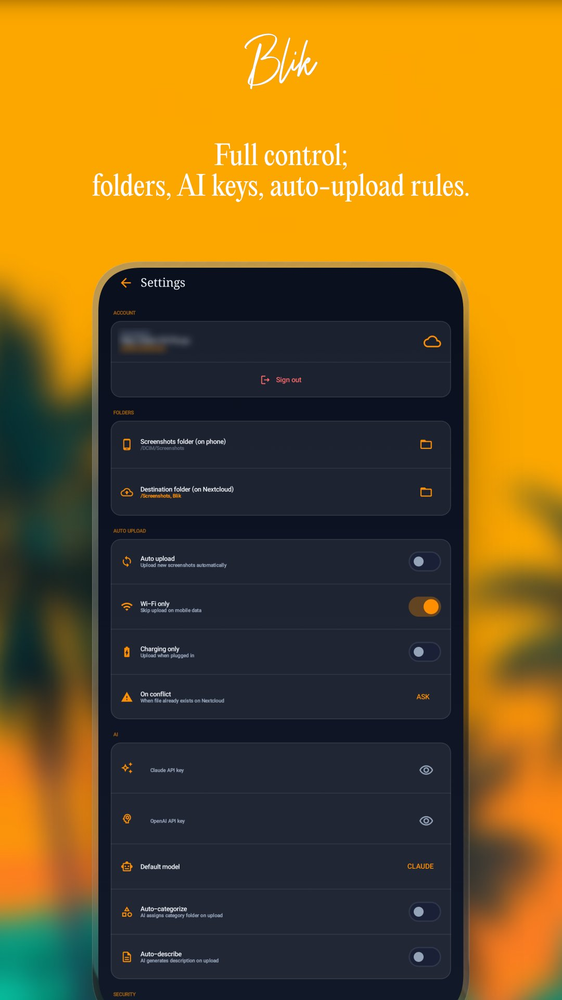

# Blik

**Blik** is a privacy-first screenshot manager for Android that connects to your own Nextcloud server. Take a screenshot, and Blik finds it, helps you organize it, and backs it up to your self-hosted cloud — with no third-party servers, no ads, and your data stays yours.

Available on [Google Play](https://play.google.com/store/apps/details?id=com.brbrs.blik).

---

## Screenshots

| Library (dark) | Library (light) | Detail | Nextcloud | Settings |
|---|---|---|---|---|
|  |  |  |  |  |

---

## Features

### Library
- Two-column screenshot gallery with upload status badges
- Filter by: All, Pending, Uploaded, Notes, ⭐ Starred, and AI-assigned categories
- Search across filenames, notes, tags, and AI descriptions
- Long-press to enter multi-select — upload, delete, blur, or star multiple screenshots at once

### Upload to Nextcloud
- Connect via Nextcloud Login Flow v2 — no passwords typed into the app
- Pick your destination folder using a built-in WebDAV folder browser
- Upload individually, in bulk, or automatically in the background
- Constraints: Wi-Fi only, charging only
- Conflict handling: Ask / Skip / Overwrite

### AI Organization
- Works with your own Claude or OpenAI API key
- Generates a description, assigns a category (travel, food, technology, etc.), and suggests tags in a single API call
- Automatically sorts uploads into category subfolders on Nextcloud
- Can run automatically on upload or on demand per screenshot

### Per-Screenshot Tools
- Add notes, tags, and Tasks.org tasks
- Star important screenshots and filter to starred only
- Privacy blur — blurs the thumbnail in the gallery (display only, nothing changes on file)
- Fullscreen viewer with pinch-to-zoom
- View file metadata: size, SHA-256 hash, remote path

### Nextcloud Tab
- Pulls the full list of files from your Nextcloud Screenshots folder via PROPFIND
- Shows thumbnails — local copy if available, loaded directly from Nextcloud if remote-only
- Badge per file: 📱 local or ☁️ remote only
- Tap for info sheet, long-press for multi-select, delete from Nextcloud directly

### Smart Deletion
- Pending screenshot: delete from phone
- Uploaded screenshot: delete from phone only, Nextcloud only, or both
- Files deleted externally (via Files or Gallery app) are detected on next scan and marked as cloud-only

### Security
- Optional biometric lock

---

## Requirements

- Android 8.0 (API 26) or higher
- A self-hosted Nextcloud instance
- Claude or OpenAI API key for AI features (optional, user's own key)

---

## Tech Stack

| Layer | Library |
|---|---|
| Language | Kotlin |
| UI | Jetpack Compose + Material 3 |
| DI | Hilt |
| Local storage | Room + DataStore |
| Networking | OkHttp + org.json (no Retrofit — avoids R8 issues) |
| Image loading | Coil |
| Background work | WorkManager |
| Auth | Nextcloud Login Flow v2 |
| File access | Storage Access Framework (SAF) |

---

## Building

```bash
git clone https://github.com/andreibarburas/android-apps.git
cd android-apps/blik
./gradlew assembleDebug
```

No API keys or secrets are required to build. AI features and Nextcloud connection require runtime configuration in Settings.

---

## Contributing

Issues, bug reports, and feature requests are welcome at:
[https://github.com/andreibarburas/android-apps/issues](https://github.com/andreibarburas/android-apps/issues)

---

## Support

- ☕ [Buy me a coffee](https://bunq.me/barburasdonations?description=Donation%20from%20Blik)
- 🌐 [barburas.com](https://barburas.com)

---

## License

Source code is provided for reference and community feedback. All rights reserved — © andrei BARBURAS.
