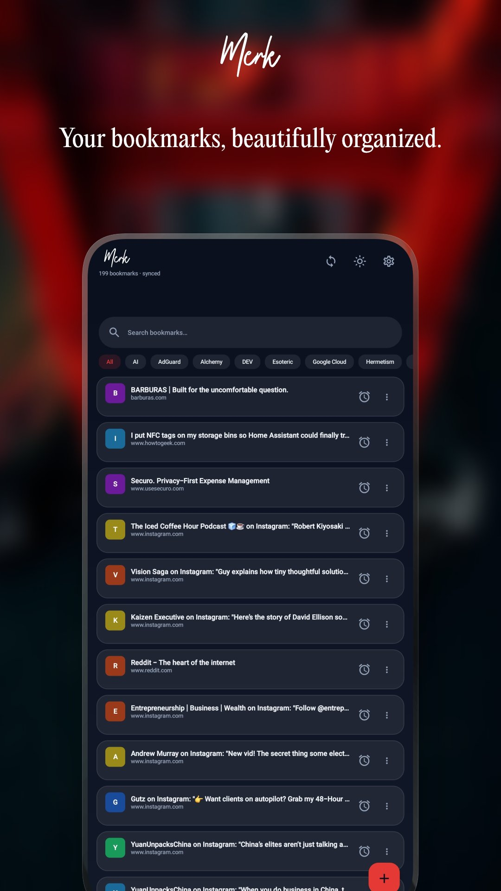
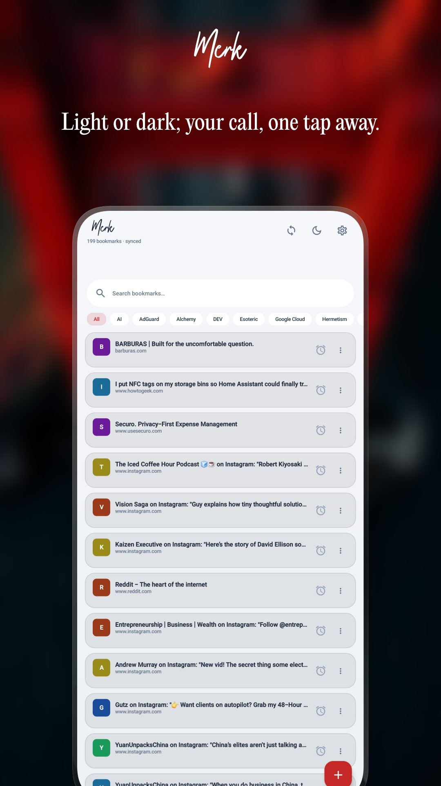
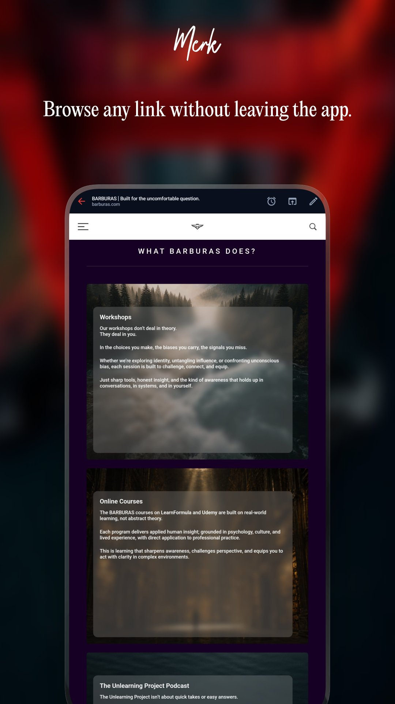
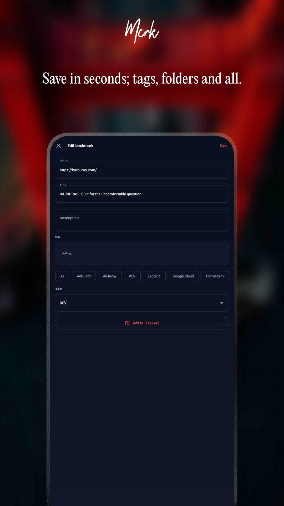
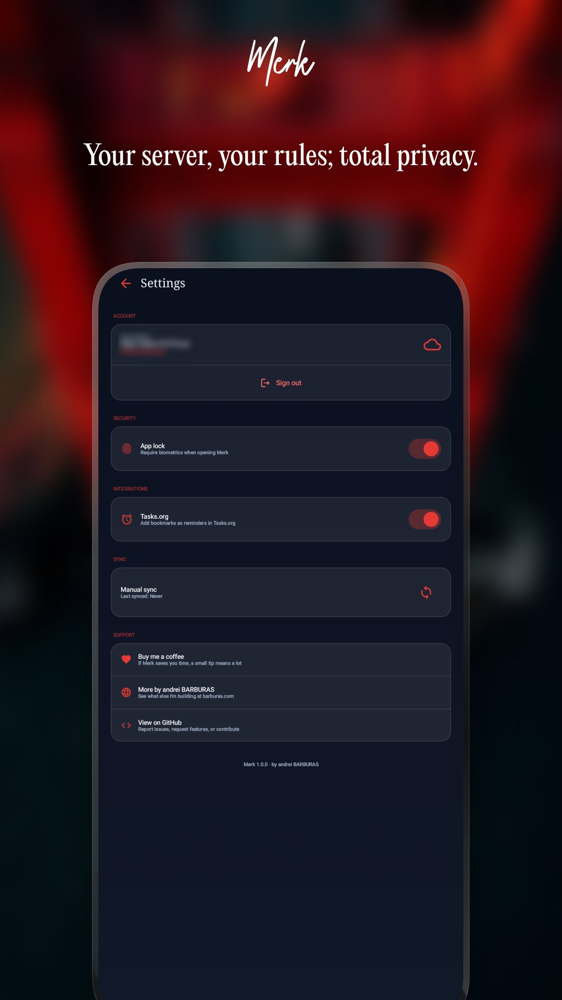

# Merk

**A beautiful Nextcloud Bookmarks client for Android.**

Merk connects to your own Nextcloud server to save, organize, and browse your bookmarks — privately, offline-first, and without any third-party cloud.

<p align="center">
  
  
  
  
  
</p>

---

## Screenshots

| # | Screen | Caption |
|---|--------|---------|
| 01 | Bookmark list — dark mode | Your bookmarks, beautifully organized. |
| 02 | Bookmark list — light mode | Light or dark; your call, one tap away. |
| 03 | In-app browser | Browse any link without leaving the app. |
| 04 | Add / edit bookmark | Save in seconds; tags, folders and all. |
| 05 | Settings | Your server, your rules; total privacy. |

---

## Features

- **Bookmark list** — instant search, tag chips, favicon initials, colored letter fallbacks
- **In-app browser** — browse bookmarks without switching apps; open in external browser anytime
- **Share target** — share any URL from Chrome or any app directly to Merk
- **Add & edit** — title, description, tags, folder picker, create new folders on the fly
- **Nextcloud sync** — Login Flow v2 authentication, offline-first with Room, auto-sync on save/delete
- **Tasks.org integration** — turn any bookmark into a reminder with one tap
- **Biometric lock** — fingerprint or PIN protection
- **Light & dark mode** — one-tap toggle right in the app

---

## Requirements

- Android 8.0 (API 26) or higher
- A [Nextcloud](https://nextcloud.com) instance with the [Bookmarks app](https://apps.nextcloud.com/apps/bookmarks) installed

---

## Tech stack

- Kotlin + Jetpack Compose + Material 3
- Hilt (dependency injection)
- Room (offline-first local database)
- OkHttp + `org.json` (no Retrofit — avoids R8 obfuscation issues)
- DataStore (settings & auth persistence)
- Coil (favicon loading)
- WorkManager / coroutines

---

## Building

```bash
git clone https://github.com/andreibarburas/android-apps.git
cd android-apps/merk
./gradlew assembleDebug
```

No API keys or special configuration needed. On first launch, enter your Nextcloud server URL to authenticate via Login Flow v2.

---

## Support

- 💙 [Buy me a coffee](https://bunq.me/barburasdonations?description=Donation%20from%20Merk)
- 🌐 [barburas.com](https://barburas.com)
- 🐛 [Report an issue](https://github.com/andreibarburas/android-apps/issues)

---

## License

Open source. See [LICENSE](../LICENSE) for details.
