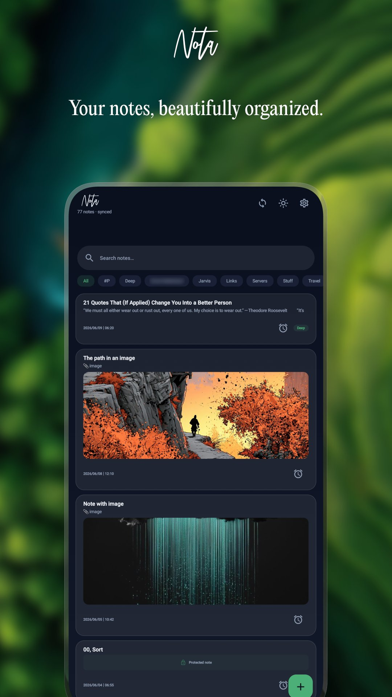
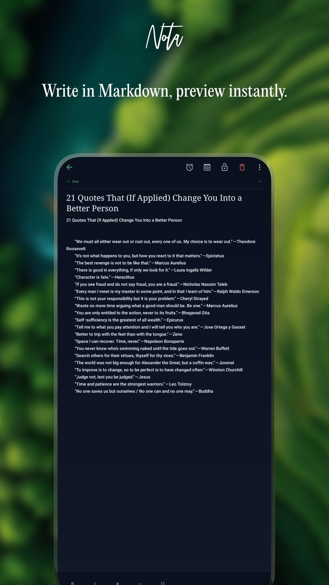
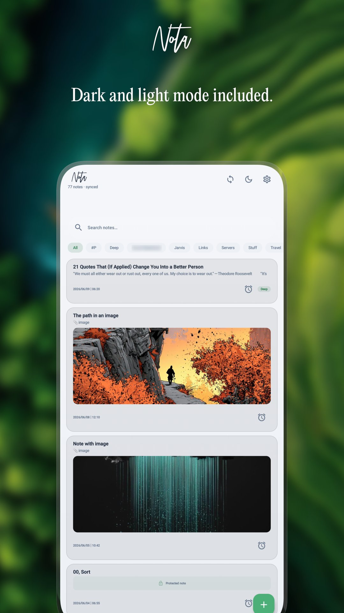
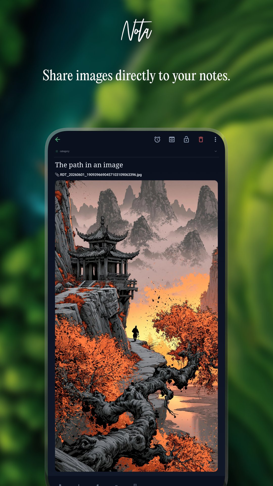
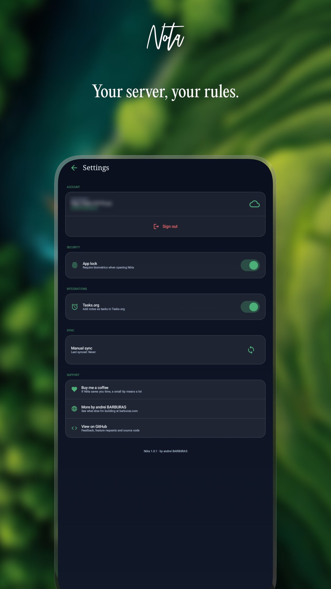

# Nóta

A beautiful, modern Nextcloud Notes client for Android. Built for people who take their privacy seriously and host their own data.

  

## Screenshots

  
  
  
  
  

## Features

- **Full sync** with your Nextcloud Notes server
- **Markdown editor** with live preview
- **Offline support** — read and write notes without internet
- **Biometric lock** — protect the whole app or individual notes
- **Image sharing** — share images from any app, uploaded to your Nextcloud
- **Share text** from any app directly into a new note
- **Category picker** with dropdown from existing categories
- **Tasks.org integration** — turn any note into a task with one tap
- **Dark and light mode** with instant toggle and persistence
- **Search** across all your notes instantly

## Requirements

- A Nextcloud server (self-hosted or via a Nextcloud provider)
- [Nextcloud Notes](https://apps.nextcloud.com/apps/notes) app installed on your server
- Android 9.0 (API 28) or higher

## Installation

Or build from source — see below.

## Building from Source

1. Clone the repository
   '''bash
   git clone https://github.com/andreibarburas/android-apps.git
   '''
2. Open the 'nota/' folder in Android Studio
3. Let Gradle sync complete
4. Build → Make Project

No API keys or special configuration required.

## Tech Stack

- Kotlin + Jetpack Compose + Material Design 3
- Hilt for dependency injection
- Room for offline-first local storage
- DataStore for preferences
- OkHttp + org.json for networking (no Retrofit/Gson)
- Nextcloud Login Flow v2 for authentication
- Coil for authenticated image loading
- WorkManager for background sync

## Privacy

Nóta communicates exclusively with your own Nextcloud server. No data is collected, no analytics, no ads, no third-party services. Your notes stay on your server.

## Support

- **Donate:** [bunq.me/barburasdonations](https://bunq.me/barburasdonations?description=Donation%20from%20Nota)
- **Website:** [barburas.com](https://barburas.com)
- **Issues & feature requests:** [open an issue](https://github.com/andreibarburas/android-apps/issues)

## License

This project is open source. See [LICENSE](LICENSE) for details.

---

*Nóta is not affiliated with or endorsed by Nextcloud GmbH.*
