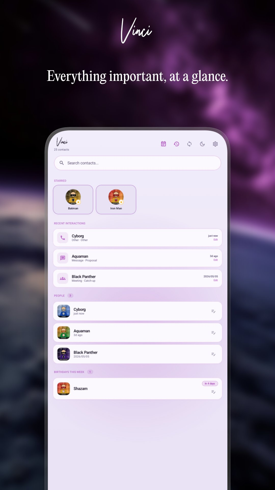
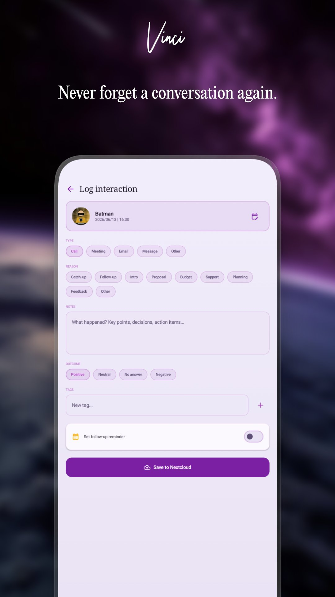
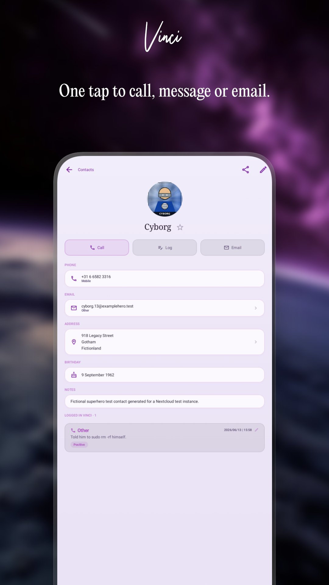
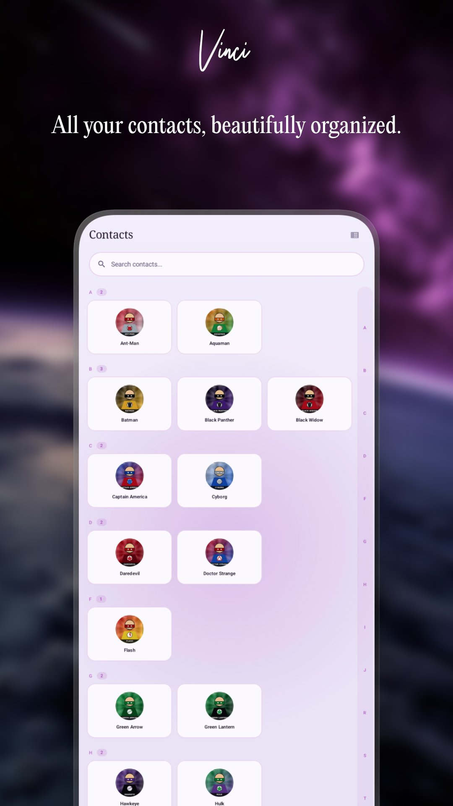
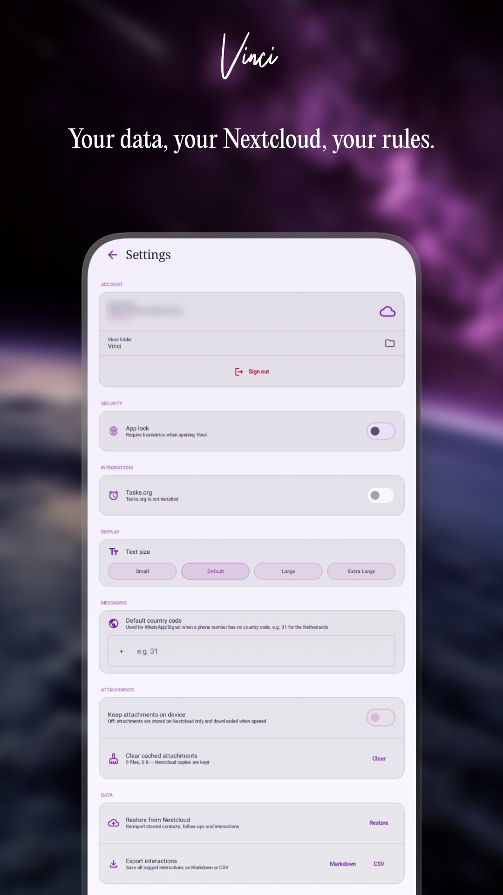
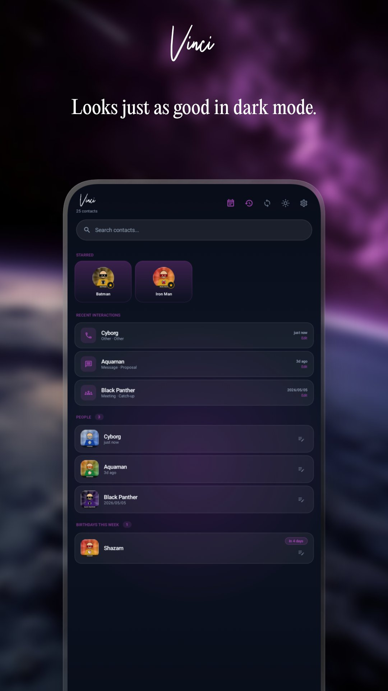

# Vinci — Personal CRM for Nextcloud

> Stay in touch with the people who matter; synced to your own Nextcloud.

[](https://play.google.com/store/apps/details?id=com.brbrs.vinci)
[](https://f-droid.org)
[](LICENSE)

---

Vinci is a free, open-source, privacy-first personal CRM for Android. Your contacts, interaction history, follow-ups, and relationship notes live entirely on your own Nextcloud — no third-party servers, no tracking, no ads.

---

## Screenshots

| Home | Log Interaction | Contact Detail |
|------|----------------|---------------|
|  |  |  |

| Contacts | Settings | Dark Mode |
|----------|----------|-----------|
|  |  |  |

---

## Features

- **Interaction logging** — Log calls, meetings, emails, messages, and social media interactions with type, reason, notes, outcome, and tags
- **Starred contacts** — Pin your most important people for quick access from the home screen
- **Follow-up reminders** — Set a follow-up reminder when logging an interaction; syncs to Tasks.org via CalDAV
- **Birthday reminders** — See upcoming birthdays on the home screen
- **Contact detail** — View all contact info (phone, email, address, birthday, notes, social links) alongside your full interaction history
- **Tag filtering** — Filter contacts by tag on the Contacts tab
- **Bulk actions** — Star or unstar multiple contacts via long-press selection
- **Markdown export** — Export a contact's full interaction history as a Markdown file
- **File attachments** — Attach files to contacts; stored on Nextcloud WebDAV
- **WhatsApp & Signal deep links** — Start a WhatsApp or Signal conversation directly from the contact detail screen
- **Text size** — Small / Default / Large / Extra Large, applied throughout the app
- **Biometric lock** — Require fingerprint or face unlock when opening Vinci
- **Dark mode** — Full dark theme support
- **Nextcloud sync** — All data syncs to your own Nextcloud via WebDAV; contacts read from DAVx5

---

## Requirements

- Android 9 (API 28) or higher
- A self-hosted [Nextcloud](https://nextcloud.com) instance
- [DAVx5](https://www.davx5.com/) (or a compatible CardDAV app) for contact sync
- [Tasks.org](https://tasks.org/) (optional) for follow-up reminders via CalDAV

---

## Privacy

Vinci has no backend. All data — interaction logs, follow-ups, attachments — is stored on **your own Nextcloud**. Vinci never connects to any server other than the one you configure. No analytics, no crash reporting, no ads, no tracking of any kind.

Privacy policy: [barburas.com/privacy-policy](https://barburas.com/privacy-policy)

---

## Building from Source

```bash
git clone https://github.com/andreibarburas/android-apps.git
cd android-apps/vinci
./gradlew assembleDebug
```

Requires Android Studio Ladybug or newer, JDK 17+.

---

## Contributing

Vinci is licensed under the [GNU General Public License v3.0](LICENSE). Pull requests are welcome. Please open an issue first for larger changes.

---

## Donate

Vinci is free and open source. If it's useful to you, consider buying me a coffee:  
[bunq.me/barburasdonations](https://bunq.me/barburasdonations)

---

## Part of the Suite

Vinci is part of a collection of free, open-source, privacy-first Android apps for the self-hosted community:  
[play.google.com/store/apps/dev?id=6842866278906089090](https://play.google.com/store/apps/dev?id=6842866278906089090)

---

*by [andrei BARBURAS](https://barburas.com)*
